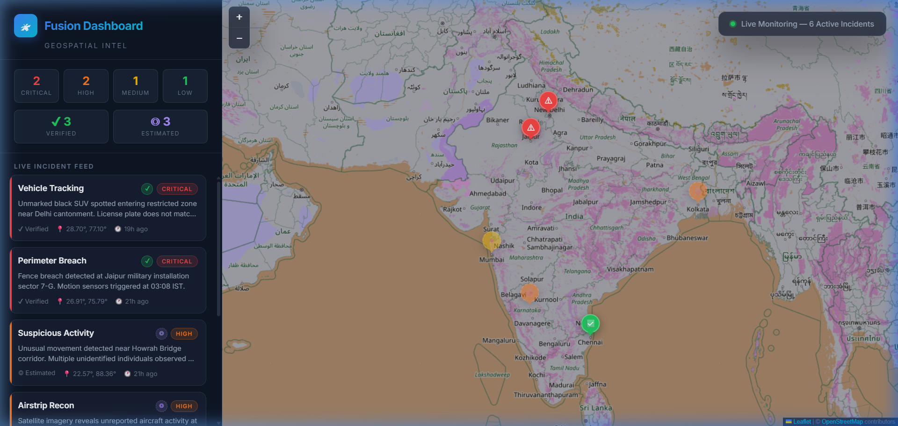
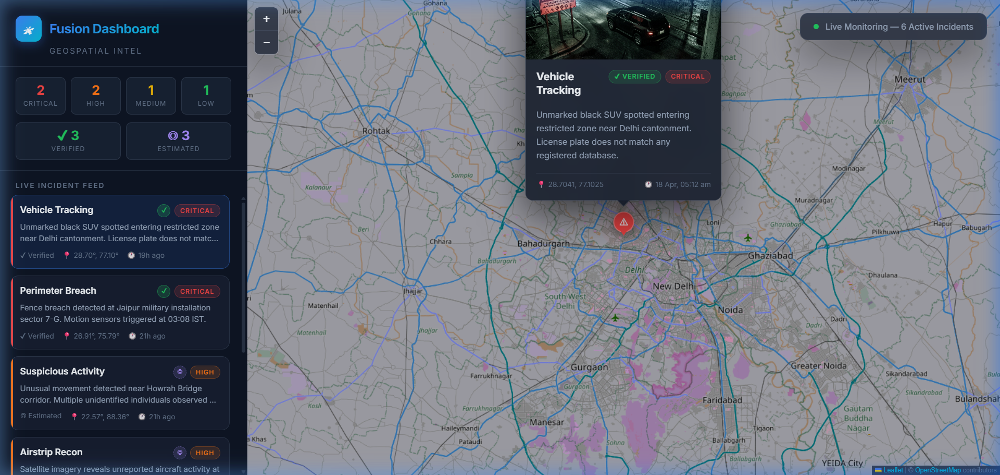
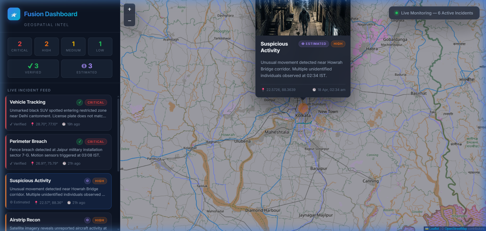

# 🛰 Fusion Dashboard — Geospatial Intelligence

A sleek, dark-themed web dashboard for real-time geospatial surveillance and incident monitoring. Built with **HTML**, **CSS**, and **JavaScript** using **Leaflet.js** and **OpenStreetMap** tiles.



---

## ✨ Features

- 🗺️ **Interactive Map** — Leaflet.js map with OpenStreetMap tiles and a custom dark filter
- 📍 **Custom Markers** — Color-coded by severity (Critical / High / Medium / Low) with animated pulse rings
- 🖼️ **Rich Popups** — Click or hover on markers to view incident image, title, severity badge, description, coordinates & timestamp
- 📋 **Sidebar Feed** — Live incident cards sorted by severity, with click-to-fly-to-marker interaction
- 📊 **Stats Bar** — At-a-glance severity count chips and verified/estimated status counts
- ✅ **Verified vs Estimated** — Visual distinction between confirmed and unconfirmed reports:
  - **Verified** → Solid markers, full opacity, pulse animation
  - **Estimated** → Semi-transparent markers, dashed border, no pulse
- 🎨 **Glassmorphism UI** — Frosted glass sidebar and popups with smooth animations
- 📱 **Responsive** — Adapts to mobile with a stacked layout

---

## 📸 Screenshots

### Dashboard Overview
Full dashboard with sidebar feed, severity & status stats, and interactive map markers.


### Verified Incident Popup
Popup for a **Verified** incident showing green `✔ VERIFIED` badge alongside the severity badge.



### Estimated Incident Popup
Popup for an **Estimated** incident showing purple `◎ ESTIMATED` badge with dashed border.



---

## 🚀 Getting Started

### Prerequisites
- A modern web browser (Chrome, Firefox, Edge, etc.)
- [Node.js](https://nodejs.org/) (optional, for local dev server)

### Run Locally

1. **Clone the repository**
   ```bash
   git clone https://github.com/sandhyasharma24/fusion-dashboard.git
   cd fusion-dashboard
   ```

2. **Serve with a local HTTP server** (recommended for proper map tile loading)
   ```bash
   npx -y http-server . -p 8080
   ```

3. **Open in browser**
   ```
   http://localhost:8080
   ```

> **Note:** Opening `index.html` directly via `file://` may cause OpenStreetMap tiles to show "Access blocked" due to their referrer policy. Use a local HTTP server instead.

---

## 📁 Project Structure

```
fusion-dashboard/
├── index.html          # Dashboard HTML shell
├── style.css           # Dark glassmorphism theme & Leaflet overrides
├── script.js           # Map initialization, markers, popups, sidebar logic
├── data.json           # Hardcoded incident marker data
├── images/             # Surveillance-themed marker images
│   ├── sample1.jpg
│   ├── sample2.jpg
│   ├── sample3.jpg
│   ├── sample4.jpg
│   ├── sample5.jpg
│   └── sample6.jpg
├── screenshots/        # App screenshots
│   ├── dashboard-overview.png
│   ├── popup-verified.png
│   └── popup-estimated.png
└── README.md
```

---

## 🗂️ Marker Data Format

Each marker in `data.json` follows this structure:

```json
{
  "id": 1,
  "lat": 22.5726,
  "lng": 88.3639,
  "title": "Suspicious Activity",
  "description": "Unusual movement detected near Howrah Bridge corridor.",
  "image": "images/sample1.jpg",
  "severity": "critical",
  "status": "verified",
  "timestamp": "2026-04-18T02:34:00"
}
```

| Field | Type | Description |
|-------|------|-------------|
| `id` | number | Unique identifier |
| `lat` / `lng` | number | GPS coordinates |
| `title` | string | Incident title |
| `description` | string | Detailed description |
| `image` | string | Path to incident image |
| `severity` | string | `critical` \| `high` \| `medium` \| `low` |
| `status` | string | `verified` \| `estimated` |
| `timestamp` | string | ISO 8601 timestamp |

### Verified vs Estimated

| Status | Map Marker | Feed Card | Popup Badge |
|--------|-----------|-----------|-------------|
| **Verified** | Solid, full opacity, pulse ring | Full opacity, ✔ icon | Green `✔ VERIFIED` |
| **Estimated** | Semi-transparent, dashed border, no pulse | Muted opacity, ◎ icon | Purple `◎ ESTIMATED` (dashed) |

---

## 🛠️ Tech Stack

- **HTML5** — Semantic structure
- **CSS3** — Glassmorphism, animations, custom properties
- **JavaScript (ES6+)** — Vanilla JS, no frameworks
- **[Leaflet.js](https://leafletjs.com/)** v1.9.4 — Interactive maps
- **[OpenStreetMap](https://www.openstreetmap.org/)** — Map tile provider
- **[Inter](https://fonts.google.com/specimen/Inter)** — Google Fonts typography

---

## 📄 License

This project is open source and available under the [MIT License](LICENSE).
